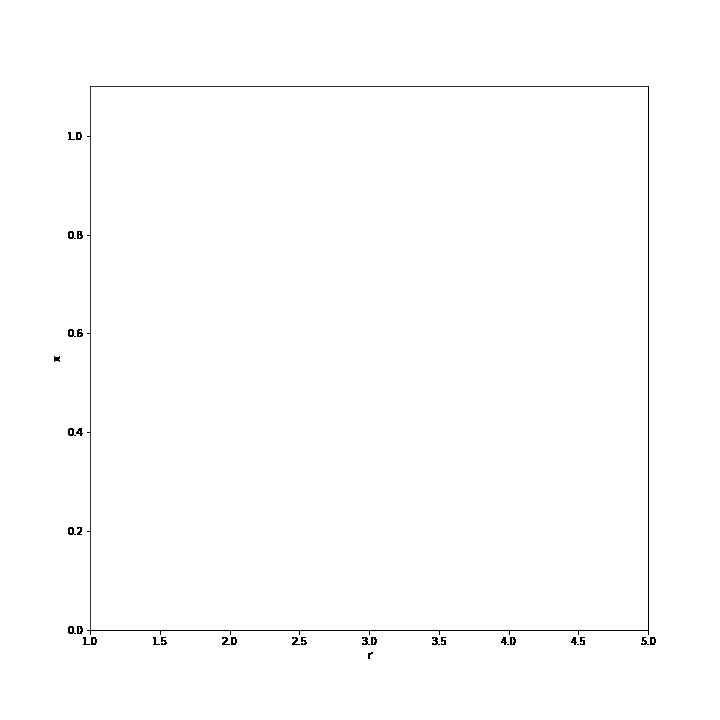

<!DOCTYPE html>

<html>
<body>

 <h1>High Performance Python Lab</h1> 
 <h2>Visualizations of the repository experiments</h1> 

 

 
  

           
       Bifurcation plot for **x_(n+1) = x_n * r * (1 - x_n)**
      
 

   

       
       Fractals generated by convergent complex numbers for z = z^2 +c
   

  

 

 
        
</body> 
</html>
